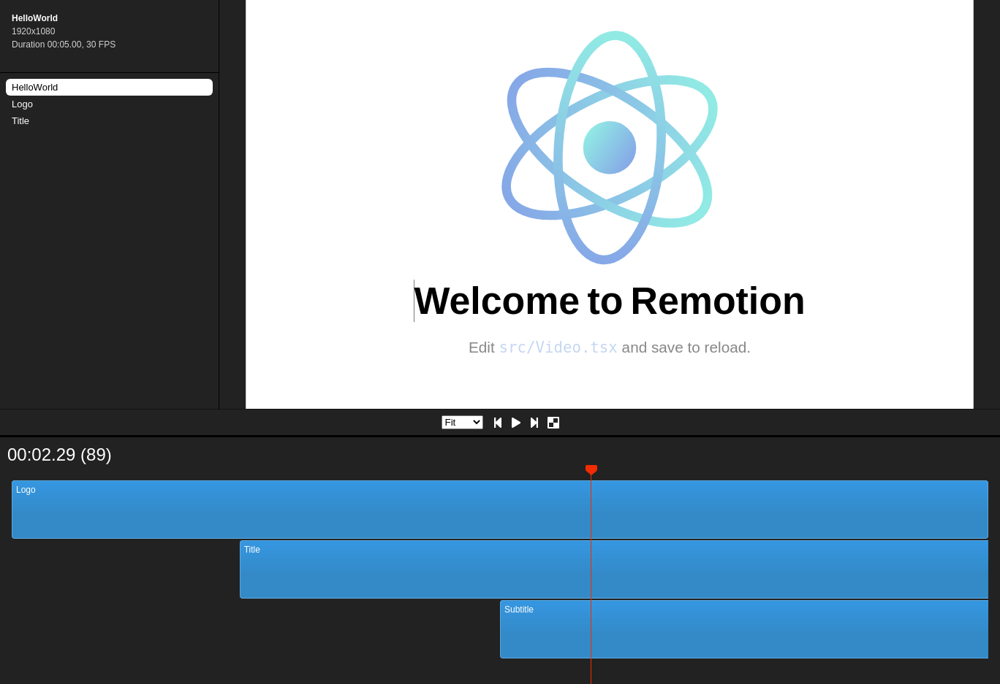

<h1 align="center">
    
</h1>

<p align="center">	
   <a href="https://www.linkedin.com/in/rafael-goulartb/">
      
   </a>
  <a href="https://github.com/RafaelGoulartB/make-video-with-code#readme">
    
  </a>
  <a href="https://github.com/RafaelGoulartB/make-video-with-code/graphs/commit-activity">
    
  </a>
  <a href="https://github.com/RafaelGoulartB/make-video-with-code/blob/master/LICENSE">
    
  </a>
  
  
  
</p>


> Making slick, animated video using React might sound far-fetched, but Remotion makes it possible! https://www.youtube.com/watch?v=ZbkYY2kZIEU


<div align="center">
  <sub>The Blog project. Built with ❤︎ by
    <a href="https://github.com/RafaelGoulartB">Rafael Goulart</a> and
    <a href="https://github.com/RafaelGoulartB/make-video-with-code/graphs/contributors">
      contributors
    </a>
  </sub>
</div>

<br />
<div align="center">
  
</div>

---

# :pushpin: Table of Contents

* [Technologies](#computer-technologies)
* [Features](#rocket-features)
* [How to run](#construction_worker-how-to-run)
* [Found a bug? Missing a specific feature?](#bug-issues)
* [Contributing](#tada-contributing)
* [License](#closed_book-license)

# :computer: Technologies
This project was made using the follow technologies:

* [Remotion](https://www.remotion.dev/)     


# :rocket: Features

- Edit videos and animations
- Exports videos and animations


# :construction_worker: How to run
**You need to installs remotions dependecies, see how to setup: https://www.remotion.dev/docs/**

### Start Preview
```console
npm start
```
### Render video
```console
npm run build
```
### Server render demo
```console
npm run server
```

See [docs for server-side rendering](https://www.remotion.dev/docs/ssr) here.


# :bug: Issues

Feel free to **file a new issue** with a respective title and description on the the [Remotion](https://github.com/RafaelGoulartB/make-video-with-code/issues) repository. If you already found a solution to your problem, **i would love to review your pull request**!


# :tada: Contributing
First of all, thank you for being interested in helping out, your time is always appreciated in every way. :100:

Here's some tips:

* Check the [issues page](https://github.com/RafaelGoulartB/make-video-with-code/issues) for already opened issues (or maybe even closed ones) that might already address your question/bug/feature request.
* Feature requests are welcomed! Provide some details on why it would be helpful for you and others, explain how you're using bull-board and if possible even some screenshots if you are willing to mock something!

Check out the [contributing](./CONTRIBUTING.md) page to see the best places to file issues, start discussions and begin contributing.

# :closed_book: License

Released in 2020.
This project is under the [MIT license](./LICENSE).

Made with love by [RafaelGoulartB](https://github.com/RafaelGoulartB) 🚀
